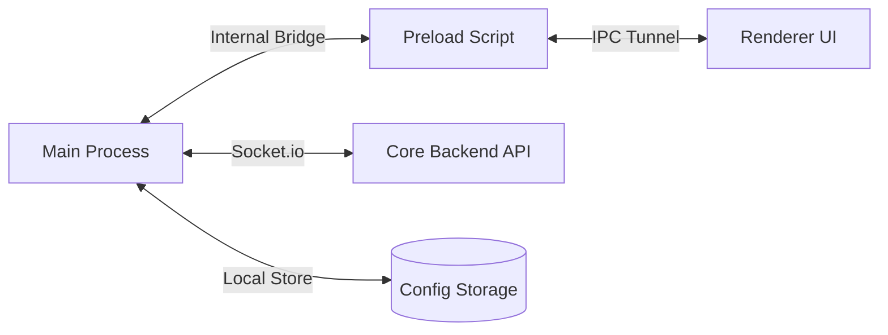

# 
🖥️ TargetUp - Core Desktop Infrastructure

  
  
  
  

---

## 💎 Overview
The low-latency, native desktop interface for the **TargetUp Ecosystem**. This application handles critical staff operations including precise attendance tracking, real-time secure communication, and system-level notifications.

### ⚡ Technical Capabilities
- **Native OS Integration**: Optimized for Windows with high-performance system-level hooks.
- **Persistent State**: Reliable local storage management via `electron-store`.
- **Hybrid Communication**: Unified Rest API (Axios) and Real-time WebSockets (Socket.io).
- **Proximity Services**: Network-level device discovery and local bridge coordination.
- **Update Engine**: Built-in support for secure, modular updates.

---

## 🏗️ Technical Stack (A to Z)

| Component | Technology | Purpose |
| :--- | :--- | :--- |
| **Foundation** | `Electron 28` | Cross-platform native application framework. |
| **Runtime** | `Node.js` | Backend logic execution within the Main process. |
| **Real-time** | `Socket.io Client` | Bi-directional live connection to the Core Backend. |
| **Persistence** | `Electron Store` | Secure local configuration and session storage. |
| **Networking** | `Axios` | Standardized HTTP communication layer. |
| **Packaging** | `Electron Builder` | Multi-target distribution (NSIS, Portable, Zip). |

---

## 🏗️ System Architecture

---

## 📡 Core Desktop Modules (A to Z)

### ⏱️ 1. Workforce Presence
- **Native Check-in**: System-aware attendance logging.
- **Heartbeat Engine**: Continuous background status synchronization.
- **Offline Buffer**: Advanced state management for intermittent connectivity.

### 💬 2. Secure Communications
- **Direct Messaging**: Low-latency internal chat integration.
- **Group Channels**: Real-time operational coordination.
- **System Tray Alerts**: Native OS notifications for mission-critical events.

### 🛡️ 3. Security & Access
- **Encrypted Local Storage**: Protection of authorization tokens.
- **Sandbox Mode**: Secure execution environment for the renderer process.

---

## 📂 Project Anatomy

- **`main.js`**: The entry point managing the application lifecycle and native windows.
- **`preload.js`**: The secure bridge between the native OS and the web frontend.
- **`renderer/`**: The visual layer, built with modern web technologies.
- **`services/`**: Modular logic for connectivity, heartbeats, and storage.
- **`assets/`**: Brand identities, icons, and static visual assets.

---

*The Native Gateway to the TargetUp Intelligent Ecosystem*

